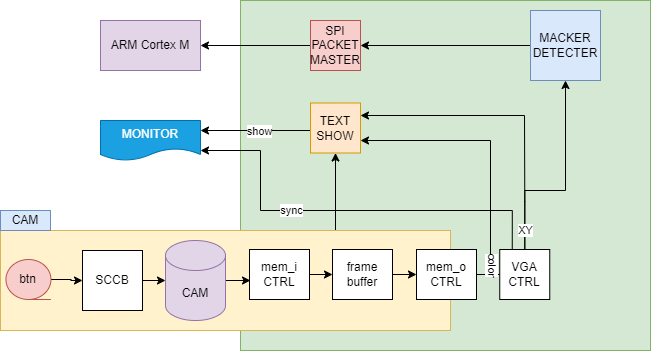
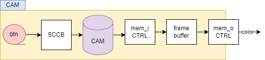
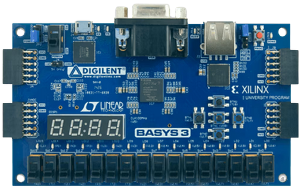
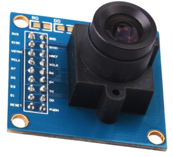

# FlagGame

> **2025년 HARMAN Semicon Academy 1기**   **개발기간: 2025.06.03 ~ 06.12**

**프로젝트트래커: https://github.com/users/cong2738/projects/2/views/1**

## 개발팀 소개

|박호윤                                          |임윤재                                            |임희주                                          |                                                                               
| :--------------------------------------------: | :--------------------------------------------:     | :---------------------------------------:      |
|   [@cong2738](https://github.com/cong2738)     |    [@immune1029](https://github.com/immune1029)      | [@Heeju99](https://github.com/Heeju99)|
|SystenArchitecture Design And VectorCalculater Algorithm Develop |ControlSignal Design, Virtual Stage Develop|ArmCortex Communication And System Develop|

|김민서                                          |박지수                                            |함영은                                          |                                                                               
| :--------------------------------------------: | :--------------------------------------------:     | :---------------------------------------:      |
|   [@minseo0511](https://github.com/minseo0511)     |    [@Friday930](https://github.com/Friday930)      | [@heyhoo46](https://github.com/heyhoo46)|
|Cam control module And HDMI QHD Output module Develop|Comunication Packet control module Develop|HandSignal Module improvement and Simulation|

## Introduce

- ImageSerchingAndDetect(FPGA)  
   - FPGA 기반으로 실시간 카메라 영상을 처리하고, 사용자의 마커의 궤적을 인식한다
   - 카메라에서 입력된 원시 영상은 직접 구현한 ISP 회로를 통해 밝기 보정과 노이즈 제거 등 전처리를 거친다.
   - ROI(Region of Interest) 영역에서 조건에 부합하는 픽셀의 개수를 카운트하여, 깃발의 색상과 위치를 판별한다.
   - HSV 변환이나 색상 분리 없이 RGB 조건만으로 픽셀을 분류하고, 각 영역에서의 개수를 비교함으로써 사용자의 동작을 인식한다. 전 과정은 순수 하드웨어(FPGA) 로직으로 구성되어, 외부 CPU 개입 없이 고속으로 처리된다. FSM 기반 제어 로직을 통해 게임 판정 및 화면 출력까지 실시간으로 수행한다.
      - HandSiagnal     : 마커를 트래킹하는 모듈
      - GRAPIC_Display  : 그래픽 처리장치(GPU), 게임상태에 따라 캠 영상에 게임UI를 오버레이하는 블록
      - SPI_PackitMaster: 데이터패킷통신을 제어하고 SPI를 통해 데이터를 송신하는 블록
- VectorCalculater(ARM Coretex M)
   - 좌표의 위치가 아닌 벡터로서 화면상 어느 위치에서든 "동일 동작 --> 동일 제어" 가능
   - 칼만 예측 적용, 잡음상황에서 신뢰성 있는 궤적 연산 가능

## Stacks
 - 핵심기술: ISP, ROI 기반 컬러 검출 마커 트레이싱, HDMI, VGA, SPI통신, 패킷컨트롤, 칼만예측
 
### Environment

### HW Development & Simulation

### SW Development

### Simulation Visualizing

### Board
 

## Objectdiabram

## GraphicCore(HW RTL)
#### SystenArchitecture
- Zybo Z7 Version 

- Basys3 Version 
 

#### Cam Block: 캠 입력 처리장치
 

#### HandSignal(MackerDetectionModule): 마커 좌표추출 모듈(ISP)
##### Module Overview
- Macker Find 
 

- Noise Filter 
 

### SIM
- MackerDetectionModule Simulation 
   1) 노이즈가 섞인 랜덤 이미지 생성
   1) 이미지를 바이너리 파일로 변환
   1) 바이너리 파일을 Sequence 클래스에서 읽어 DUT 입력으로 사용

 

 

_ _ _ _ _ _

## DataCore(CPU)

## asset

<table>
   <tr>
      <td>Basys3</td>
      <td>OV7670</td>
      <td>STM32-f411</td>
   </tr>
   <tr>
      <td></td>
      <td></td>
      <td></td>
   </tr>
</table>

<table>
   <tr>
      <td>Ztbo</td>
      <td>PCAM(OV5640)</td>
      <td>STM32-f411</td>
   </tr>
   <tr>
      <td></td>
      <td></td>
      <td></td>
   </tr>
</table>

## video  
click!--> 
